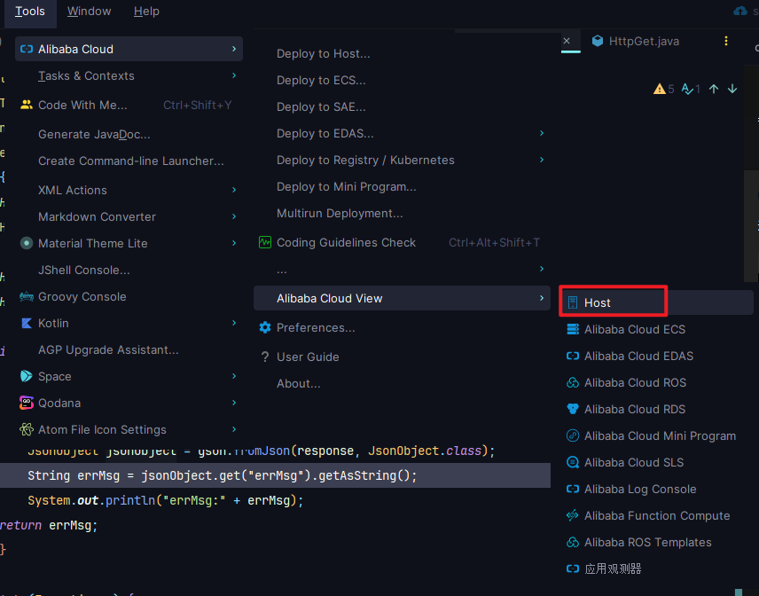
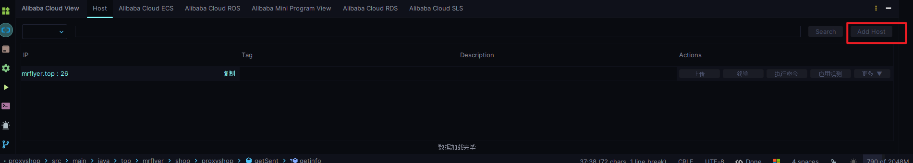
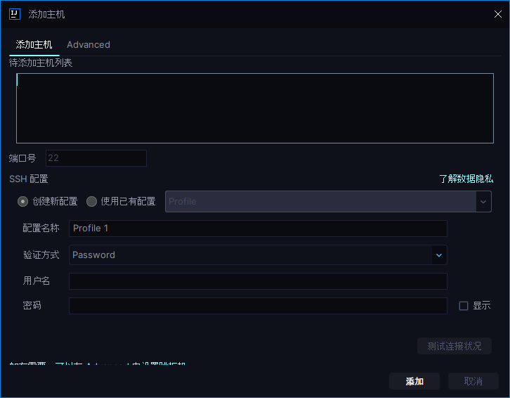
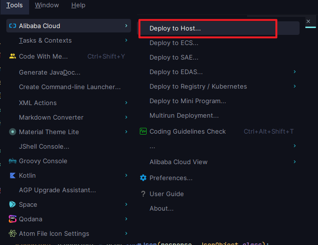
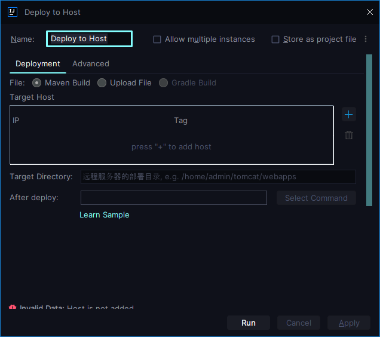

# IDEA远程调试并且上传文件到服务器并执行对应命令

## 使用原因

社区版本的IDEA阉割掉了原有的ssh链接上传功能，这里通过使用阿里云的插件来实现对应功能的使用

在安装完成后会在设置中多出一个tools/aliyun tools，在其中选择对应选项

在下边栏中点击add host

既可以对数据进行添加

添加完成并且保证正常连接上之后，再回到进行添加路径

完成后既可以实现直接maven打包构建直接上传并且可以在上传完成之后直接执行命令

例：`nohup java -jar /root/proxy/shop/proxyshop-0.0.1-SNAPSHOT.jar > /root/proxy/shop/temp.txt &`在上传完成后直接启动程序非常之优雅

