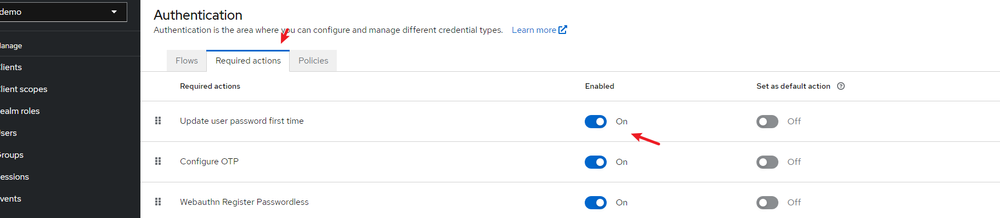
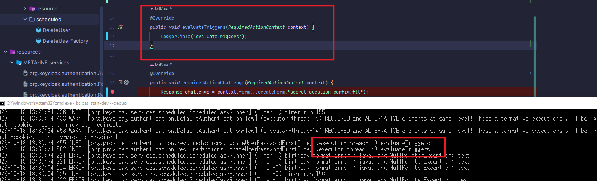
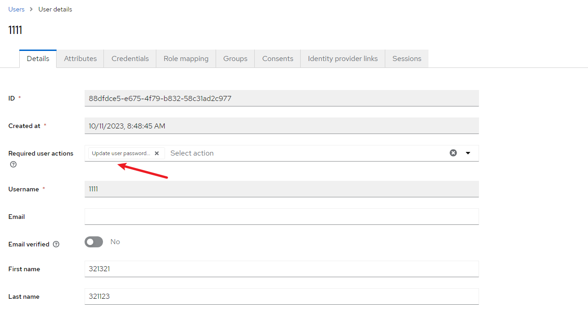

### ~~RequiredAction已有问题~~

- [x] 在实现RequiredActionProvider的时候只能进入到evaluateTriggers不能正常进入其他b部分进行生成页面以及相关对应的逻辑处理，不知道是哪里设置存在问题

```java
    @Override
    public void evaluateTriggers(RequiredActionContext context) {
        logger.info("evaluateTriggers");
    }

    @Override
    public void requiredActionChallenge(RequiredActionContext context) {
        Response challenge = context.form().createForm("secret_question_config.ftl");
        context.challenge(challenge);
    }

    @Override
    public void processAction(RequiredActionContext context) {
        String answer = (context.getHttpRequest().getDecodedFormParameters().getFirst("answer"));
        UserCredentialModel model = new UserCredentialModel();
        logger.info("Answer is " + answer);
        context.success();
    }
```



这里是Factory部分设置

```java
public class UpdateUserPasswordFirstTimeFactory implements RequiredActionFactory {
    @Override
    public String getDisplayText() {
        return "Update user password first time";
    }

    @Override
    public RequiredActionProvider create(KeycloakSession session) {
        return new UpdateUserPasswordFirstTime();
    }

    @Override
    public void init(Config.Scope config) {

    }

    @Override
    public void postInit(KeycloakSessionFactory factory) {

    }

    @Override
    public void close() {

    }

    @Override
    public String getId() {
        return "update-password-first-time";
    }
```

- [x] 目前来说在Authentication中的RequiredAction中只发现了启用，没有发现实在哪里使用它，不知道是自动就在KeyCloak用户调用时候就会触发还是说需要类似其他的provider进行设置flow使用



目前是只进入到了evaluateTriggers下并没有进入到其他的方法当中，已经选择了为默认用户提供选择仍然问题一样

- 通过logger打出来看哪里被调用哪里还没有被调用

### 解决方案

1. 首先在Authentication中选择Required actions，然后选择对应的provider将其开启并且选择为为每个新建的用户都添加这个功能


2. 在开启了之后来到Users列表点进入一个用户，在Required user actions 列表中选择刚刚添加好的provider然后再使用其进行登陆及可


