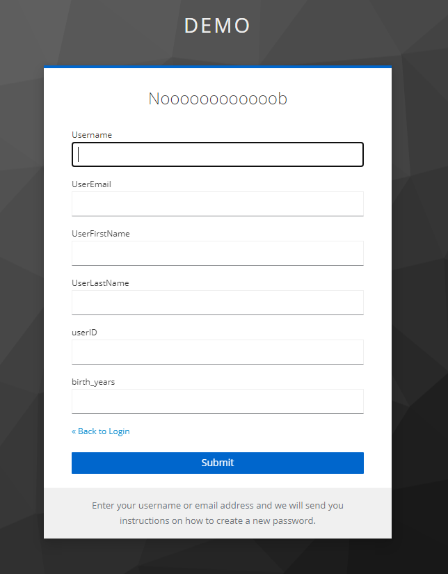
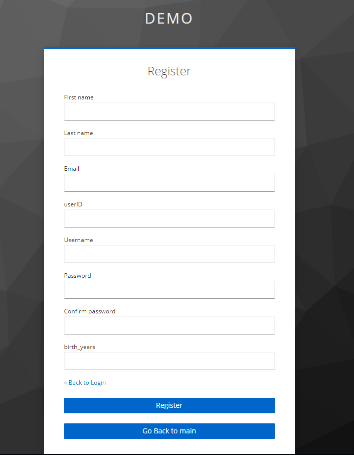
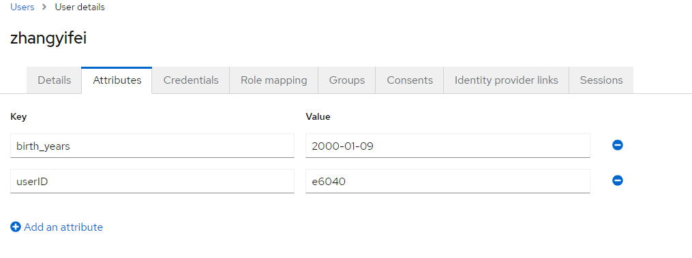

# 用户数据注册配置以及自定义配置导入

## TAG

- FormAction

- Attributes

- 注册Flow

- 忘记密码重设密码ResetFlow

- 多数据相互整合

## 效果

- 忘记密码ResetFlow展示效果需要提供姓名，邮箱，用户ID以及在注册时候的输入的生日年龄，在比对成功之后才能进入到后续的密码重设界面



- 下图为注册密码界面，在用户注册的时候需要输入姓以及名，并且输入邮箱，用户ID，出生年月日等，并且对于用户密码的输入也有相对应的要求：用户的密码不能与邮箱的@之前数字想相同，如果出现相同的情况则会反应报错页面，在之后重新输入注册。



- 下图为用户注册完成之后所输入的特殊自动添加到用户的自有属性之下，来为后续的组测以及其他的部件调用做准备



## 怎么做

### 前后端数据收发

- 首先是在html之中添加所需要的部分的代码，进行显示，并且数据回传以及一系列其他的操作，例如这里提供了输入用户年龄的输入框，对于这段代码来说发送的数据会是以`birth_years：xxxxx`的方式发送出去只需要在另外一端做好数据接收即可

```html
            <!--birth——years输入-->
<div class="${properties.kcFormGroupClass!}">
    <div class="${properties.kcLabelWrapperClass!}">
        <label for="birth_years" class="${properties.kcLabelClass!}">${msg("birth_years")}</label>
    </div>
    <div class="${properties.kcInputWrapperClass!}">
        <input type="text" id="birth_years" name="birth_years" class="${properties.kcInputClass!}" autofocus value="${(auth.attemptedUsername!'')}" aria-invalid="<#if messagesPerField.existsError('username')>true</#if>"/>

        <#if messagesPerField.existsError('birth_years')>
            <span id="input-error-username" class="${properties.kcInputErrorMessageClass!}" aria-live="polite">
                        ${kcSanitize(messagesPerField.get('birth_years'))?no_esc}
            </span>
        </#if>
    </div>
</div>
```

- 对于后端来说接受数据也是十分重要的一环，如何正确的处理数据以及正确的也是十分重要的，可以通过`user.getEmail()...`等等方式来获取用户已经设置好的数据，然后在通过从前端发回来的表格formData等等通过使用`formData.getFirst`的方式对于特定字段的数据进行获取在完成之后在对获取的数据进行二次处理即可

```java
        String userEmail = user.getEmail();
        String userFirstName = user.getFirstName();
        String userLastName = user.getLastName();
        String userUserID = user.getFirstAttribute("userID");
        String userBrith =  user.getFirstAttribute("birth_years");
        String inputEmail = formData.getFirst("useremail");
        String inputUserFirstName = formData.getFirst("user-firstname");
        String inputUserLastName = formData.getFirst("user-lastname");
        String inputUserID = formData.getFirst("userID");
        String inputUserBrith =  formData.getFirst("birth_years");
```


