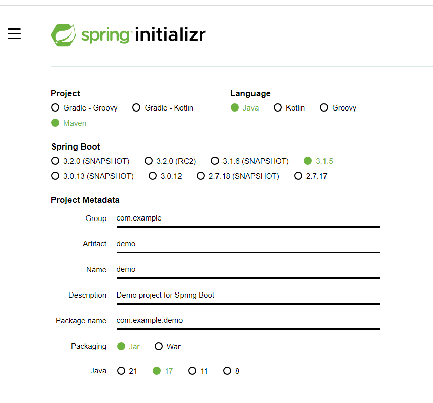

# 基于SpringBoot的Java get请求开发

## 关键词

- Springboot

- Java

- GET请求

## 具体实现

1. 首先在[初始化SpringBoot项目](https://start.spring.io/)根据当前的环境创建一个项目，根据现有环境创建一个为Maven的java项目，SpringBoot版本为3.1.5



2. 直接使用IDEA等编辑器直接打开相对应的工程，整体工程目录如下
   
   - 项目中主要程序集中在src下包含着SpringBoot的配置以及SpringBoot的起始源码
   
   - 其中xxxxxApplication则为整个Springboot的入口，所有会从这里启动
   
   - 可以自行在文件夹下添加其他的类
   
   - 在resources下有一个application.xxxxx文件，可以保持原有文件格式使用xml的方式进行编写，也可以将其改名称为application.yml来用yml的方式编辑。
     
     - 其中可以设置Springboot的所有属性，包括占用端口，拓展插件设置以及一系列其他的东西

```cmd
C:.
│  .gitignore
│  HELP.md
│  mvnw
│  mvnw.cmd
│  pom.xml
│
├─.idea
│      .gitignore
│      compiler.xml
│      encodings.xml
│      jarRepositories.xml
│      misc.xml
│      uiDesigner.xml
│      vcs.xml
│      workspace.xml
│
├─.mvn
│  └─wrapper
│          maven-wrapper.jar
│          maven-wrapper.properties
│
├─src
│  ├─main
│  │  ├─java
│  │  │  └─top
│  │  │      └─mrflyer
│  │  │          └─shop
│  │  │              └─proxyshop
│  │  │                      control.java
│  │  │                      getSent.java
│  │  │                      ProxyshopApplication.java
│  │  │
│  │  └─resources
│  │          application.yml
│  │
│  └─test
│      └─java
│          └─top
│              └─mrflyer
│                  └─shop
│                      └─proxyshop
│                              ProxyshopApplicationTests.java
│
└─target
    │  proxyshop-0.0.1-SNAPSHOT.jar
    │  proxyshop-0.0.1-SNAPSHOT.jar.original
    │
    ├─classes
    │  │  application.yml
    │  │
    │  └─top
    │      └─mrflyer
    │          └─shop
    │              └─proxyshop
    │                      control.class
    │                      getSent.class
    │                      ProxyshopApplication.class
    │
    ├─generated-sources
    │  └─annotations
    ├─generated-test-sources
    │  └─test-annotations
    ├─maven-archiver
    │      pom.properties
    │
    ├─maven-status
    │  └─maven-compiler-plugin
    │      ├─compile
    │      │  └─default-compile
    │      │          createdFiles.lst
    │      │          inputFiles.lst
    │      │
    │      └─testCompile
    │          └─default-testCompile
    │                  createdFiles.lst
    │                  inputFiles.lst
    │
    ├─surefire-reports
    │      TEST-top.mrflyer.shop.proxyshop.ProxyshopApplicationTests.xml
    │      top.mrflyer.shop.proxyshop.ProxyshopApplicationTests.txt
    │
    └─test-classes
        └─top
            └─mrflyer
                └─shop
                    └─proxyshop
                            ProxyshopApplicationTests.class

```

## 代码部分

### 主入口ProxyShopApplication

```java
@SpringBootApplication
public class ProxyshopApplication {

	public static void main(String[] args) {
		SpringApplication.run(ProxyshopApplication.class, args);
	}

}
```

这里`@SpringBootApplication`为Springboot的启动类注释，Springboot会从这里进行启动内部包含了`@SpringBootConfiguration`、`@EnableAutoConfiguration`和`@ComponentScan`三个注解。这三个注解的作用如下

1. `@SpringBootConfiguration`：这个注解表示这是一个Spring Boot配置类，Spring Boot会自动扫描这个类中的Bean定义。
2. `@EnableAutoConfiguration`：这个注解表示启用自动配置。当Spring Boot启动时，它会自动扫描配置类，并根据类中的Bean定义创建相应的Bean。
3. `@ComponentScan`：这个注解表示Spring Boot需要扫描配置类中的Bean定义。

### 自建控制类Control

```java
@RestController
public class control {

    public int countNum = 0;
    @RequestMapping("/getinfo")
    public String getinfo() {
        getSent getSent = new getSent();
        countNum += 1;
        return getSent.getinfo(countNum);
    }
}
```

这里包含了一个`@RestController`注释`@RestController`是一个组合注解，它包括了`@Controller`和`@ResponseBody`两个注解。这两个注解的作用如下：

1. `@Controller`：这个注解表示这是一个Spring MVC控制器。Spring MVC是一个Model-View-Controller（MVC）框架，控制器负责接收请求，处理数据并将结果返回给客户端。
2. `@ResponseBody`：这个注解表示将方法的返回值作为HTTP响应体。当客户端发起一个HTTP请求时，服务器会返回一个HTTP响应，这个响应体就是`@ResponseBody`注解指定的返回值。

这里我通过将其注释成为了接受get请求的接口，接口为`xxx/getinfo`，在外部的get请求发过来之后会进入到函数当中，然后根据写好的逻辑进行处理数据以以及一些其他的操作等等，在完成之后将数据`return`回去之后就可以将数据返回回来

### 逻辑处理部分getSent

```java
public class getSent {

    private String URL = "";
    public String getinfo(int count) {
        LocalDateTime dateTime = LocalDateTime.now();
        DateTimeFormatter formatter = DateTimeFormatter.ofPattern("dd-MM-yyyy HH:mm:ss");
        String timeNow = dateTime.format(formatter);
        System.out.println("已经触发" + count + "次" + "时间为： " + timeNow);
        try {
            HttpClient httpClient = HttpClients.createDefault();
            HttpGet httpGet = new HttpGet(URL);

            HttpResponse httpResponse = httpClient.execute(httpGet);
            HttpEntity httpEntity = httpResponse.getEntity();

            if (httpEntity != null){
                String response = EntityUtils.toString(httpEntity);
//                System.out.println(response);
                Gson gson = new Gson();
                JsonObject jsonObject = gson.fromJson(response, JsonObject.class);
                String errMsg = jsonObject.get("errMsg").getAsString();
                System.out.println("errMsg:" + errMsg);
            return errMsg;
            }

        } catch (Exception e) {
            e.printStackTrace();
        }
        return null;
    }
}
```

这里使用了`HttpEntity,HttpResonse,HttpClient`三个包以及其他附属拓展，并且在添加log之后可以看到运行状况于是使用`LocalDateTime`来监视什么时候被调用以及调用了几次

#### 具体流程

1. 通过`LocalDateTime`创建了一个dateTime对象，将其赋值为`LocalDateTime.now`然后再创建了一个名为formatter的`DateTimeFormatter`对象来规定具体时间格式为`"dd-MM-yyyy HH:mm:ss"`，在使用一个timeNow的String来接受对应格式整理后的数据来给后续的print中打印出来

2. 通过`HttpClient`创建了一个httpClient的对象后创建了一个HTTP客户端用于发送HTTP的请求，使用`HttpClients.createDefault()`来创建一个默认的`HttpClient`实例

3. 随后的`httpGet`创建了一个get请求实例url为其中的请求目标地址

4. `HttpResponse`：`HttpResponse`是服务器响应的实现，包含服务器返回的HTTP响应头和响应体。这里使用`httpClient.execute(httpGet)`来发送GET请求并获取响应，然后将响应赋值给`HttpResponse`对象。

5. `HttpEntity`：`HttpEntity`是HTTP响应体。这里使用`httpResponse.getEntity()`来获取响应体，然后将其赋值给`HttpEntity`对象

6. 在数据返还回来之后进行判断，在判断无误之后通过使用`Gson`来进行数据解析，将所需要的部分通过`gson.fromJson(response, JsonObject.class)`转换出来之后，`String errMsg = jsonObject.get("errMsg").getAsString();`赋值给errMsg来实现了数据的传输，并且return回给上层程序，实现了逻辑的调用


